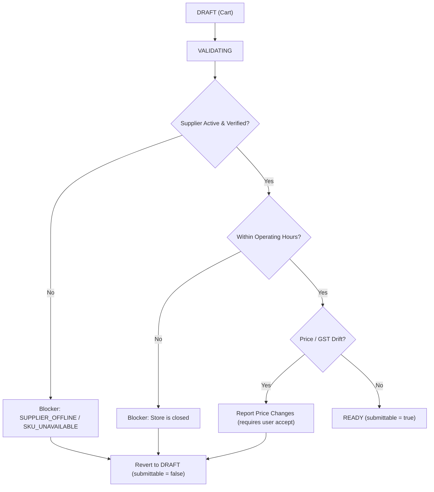

# Local Development: Authentication, Operating Hours & Order Placement Guide

This guide documents the local authentication flow (mock OTP) and the order placement validation rules (supplier verification, operating hours, tradeability) in the Costonomy Marketplace.

---

## 1. Local Authentication & Mock OTP

### 1.1 Overview
In local development (`spring.profiles.active=local`), SMS delivery is bypassed. Instead, the backend uses a mock OTP mechanism configured in `application-local.properties`:

```properties
costonomy.mp.otp.mock-code=123456
costonomy.mp.jwt.secret=local-dev-jwt-secret-key-must-be-at-least-32-bytes!
```

### 1.2 Authentication Flow

1. **Request OTP**:
   - **Endpoint**: `POST /api/v1/auth/otp/request`
   - **Headers**: `Content-Type: application/json`
   - **Body**:
     ```json
     {
       "phone": "+919885051802",
       "purpose": "LOGIN"
     }
     ```
   - *Note*: Phone number can be with or without the `+91` prefix (normalized by `PhoneNumbers.java`). `purpose` is required (`LOGIN`, `REGISTRATION`, or `PASSWORD_RESET`).
   - **Response**:
     ```json
     {
       "data": {
         "expiresAt": "2026-09-25T16:55:09Z",
         "resendAfterSeconds": 60,
         "maxAttempts": 5,
         "maskedPhone": "+91******1802"
       },
       "error": null
     }
     ```

2. **Verify OTP**:
   - **Endpoint**: `POST /api/v1/auth/otp/verify`
   - **Body**:
     ```json
     {
       "phone": "+919885051802",
       "otp": "123456",
       "purpose": "LOGIN"
     }
     ```
   - **Response**:
     Returns `accessToken` (JWT), `refreshToken`, and user identity information.

---

## 2. Order Placement Prerequisites & Validation Flow

### 2.1 The Validation Pipeline (`/validate`)

Before any order can be placed from UI (`POST /api/v1/procurements/{id}/submit`), it must be in **`READY`** status (`submittable = true`).



When a cart is viewed or refreshed on `/restaurant/checkout/{id}`:
- If `data.submittable` is `false`, the **"Place order and pay"** CTA button is **disabled**.
- If `data.validationStale` is `true`, a prompt card **"Prices need a re-check"** appears.

### 2.2 Five Key Prerequisites for `submittable = true`

| Requirement | Code Check | Failure Result |
| :--- | :--- | :--- |
| **1. Supplier Organization** | `so.lifecycle_status == 'ACTIVE'` | Blocker: `SUPPLIER_OFFLINE` (*"{Supplier} isn't accepting orders right now."*) |
| **2. Supplier Store** | `ss.status == 'ACTIVE'` | Blocker: `SUPPLIER_OFFLINE` |
| **3. Operating Hours** | `hours.isOpenAt(ZonedDateTime.now(OperatingHours.ZONE))` | Blocker: `SUPPLIER_OFFLINE` (*"{Supplier} is closed. They open at {opensAt}."*) |
| **4. Live Offer & Stock** | `offer.isPurchasable()` (`ACTIVE` & `AVAILABLE`) | Blocker: `SKU_UNAVAILABLE` (*"This product is out of stock."*) |
| **5. Price & GST Stability** | `Pricing.differs(...) == false` | Attached to `priceChanges`. Must be accepted via `acceptPriceChanges: true`. |

---

## 3. Supplier Operating Hours (`OperatingHours.java`)

### 3.1 Trading Hours Logic
In `com.costonomy.mp.supplier.domain.OperatingHours`:
- Evaluated against timezone: **`Asia/Kolkata`** (`GMT+05:30`).
- **Default Hours**: When `supplier_store.operating_hours_json` is `NULL` or empty, the default is:
  - **Open**: `10:00` (10:00 AM IST)
  - **Close**: `21:00` (9:00 PM IST)
  - **Days**: Monday through Sunday (all 7 days)
- **Night-time Testing Issue**: If testing after 9:00 PM IST, default-hour stores will be evaluated as **closed** (`openNow() = false`).

### 3.2 24/7 Store Configuration
To make a store tradeable 24 hours a day (around the clock) without hour restrictions, set `opensAt` and `closesAt` to identical times (e.g. `00:00` and `00:00`):

```json
{
  "days": ["MONDAY", "TUESDAY", "WEDNESDAY", "THURSDAY", "FRIDAY", "SATURDAY", "SUNDAY"],
  "opensAt": "00:00",
  "closesAt": "00:00"
}
```

---

## 4. Quick SQL Setup for Local Development

To immediately unblock checkout testing for Supplier 1 (Bhavana Suppliers) and Store 1 (Bachupally warehouse) at any time of day:

```sql
USE costonomy_mp;

-- 1. Mark verification as completed
UPDATE supplier_verification 
SET status = 'VERIFIED', reviewed_at = NOW(), verified_at = NOW() 
WHERE supplier_organization_id = 1;

-- 2. Activate supplier organization
UPDATE supplier_organization 
SET verification_status = 'VERIFIED', lifecycle_status = 'ACTIVE' 
WHERE id = 1;

-- 3. Set store to ACTIVE and configure 24/7 operating hours
UPDATE supplier_store 
SET status = 'ACTIVE',
    operating_hours_json = '{"days":["MONDAY","TUESDAY","WEDNESDAY","THURSDAY","FRIDAY","SATURDAY","SUNDAY"],"opensAt":"00:00","closesAt":"00:00"}'
WHERE supplier_organization_id = 1;

-- 4. Ensure current offers are active and available
UPDATE supplier_offer 
SET status = 'ACTIVE', availability = 'AVAILABLE' 
WHERE supplier_store_id = 1;
```

---

## 5. Summary Checklist for UI Checkout Testing

If the **"Place order and pay"** button is disabled on `http://localhost:7071/restaurant/checkout/{id}`:
1. Check if the **"Prices need a re-check"** card is visible. If so, click **"Re-check prices"**.
2. If a red warning appears:
   - *"is closed. They open at 10:00"*: Update `supplier_store.operating_hours_json` to 24/7 (see Section 4).
   - *"isn't accepting orders right now"*: Activate the supplier organization (`lifecycle_status = 'ACTIVE'`).
   - *"out of stock"*: Set `supplier_offer.availability = 'AVAILABLE'`.
3. Once the checks pass, the backend returns `submittable: true` with status `READY`, enabling the submission CTA.
