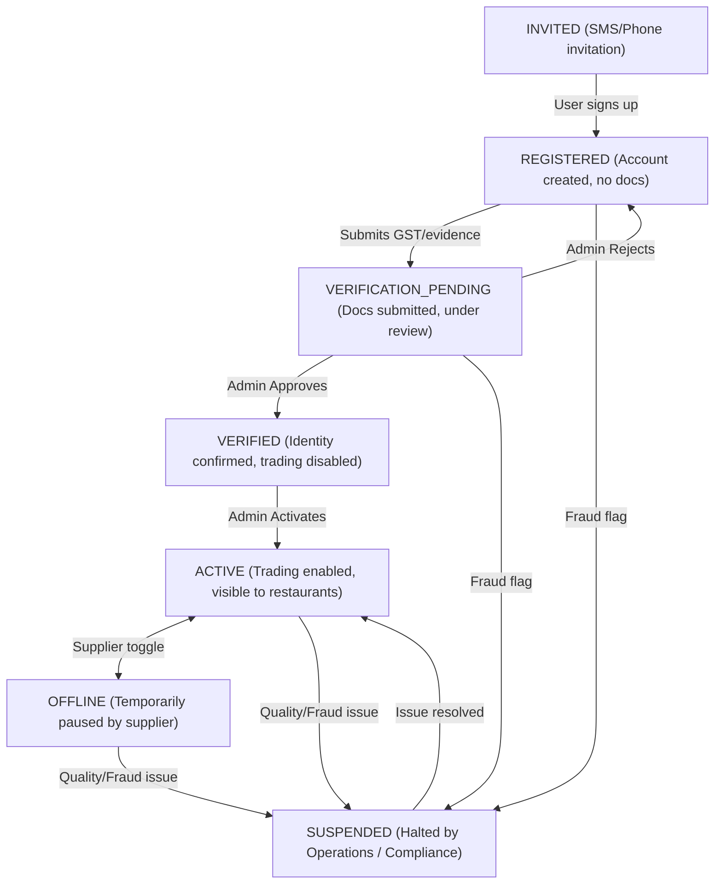

# Supplier Lifecycle, Verification & Marketplace Discovery

This guide explains how supplier onboarding, verification, and activation work across **Costonomy Mandi**, how suppliers become visible to restaurants, and how to verify and activate suppliers during local development and testing.

---

## 1. Core Principles

1. **Verification $\neq$ Activation (Separation of Concerns)**:
   - **`VERIFIED`**: Confirms *who* the business is (tax compliance, GSTIN authenticity, legal entity name). A verified supplier **cannot** yet trade.
   - **`ACTIVE`**: An explicit operational decision to permit the supplier to publish catalogs, receive orders, and appear in restaurant search.
2. **Marketplace Discovery Guardrail**:
   - Restaurants and kitchens **only see suppliers and stores that are `ACTIVE`**.
   - If a supplier is in `REGISTERED`, `VERIFICATION_PENDING`, or `VERIFIED`, neither their stores nor their SKUs appear in restaurant searches or product comparisons.
3. **One GSTIN, One Supplier**:
   - `supplier_organization.gstin` has a unique database index (`uk_supplier_org_gstin`).
   - A business cannot register multiple times under the same tax ID to fragment performance history.
   - Once verified, the GSTIN is locked and cannot be changed without admin intervention.

---

## 2. Supplier Lifecycle State Machine



### State Transitions Table

| Current State | Allowed Next States | Trigger / Actor |
|---|---|---|
| `INVITED` | `REGISTERED` | Supplier user registers via OTP flow. |
| `REGISTERED` | `VERIFICATION_PENDING`, `SUSPENDED` | Supplier submits verification documents (`submitVerification`). |
| `VERIFICATION_PENDING` | `VERIFIED`, `REGISTERED`, `SUSPENDED` | Platform Admin reviews: **Approve** moves to `VERIFIED`; **Reject** returns to `REGISTERED` so errors can be corrected. |
| `VERIFIED` | `ACTIVE`, `SUSPENDED` | Platform Admin explicitly activates the supplier (`activate`). |
| `ACTIVE` | `OFFLINE`, `SUSPENDED` | Supplier sets store offline, or operations suspends. |
| `OFFLINE` | `ACTIVE`, `SUSPENDED` | Supplier sets store active again. |
| `SUSPENDED` | `ACTIVE` | Operations reinstates after resolving dispute/audit. |

---

## 3. What Makes a Supplier "Verified"?

A supplier becomes **`VERIFIED`** when:

1. **Valid Tax Identification (`GSTIN`)**:
   - A 15-character Indian Goods & Services Tax Identification Number (e.g. `36AAACH7409R1Z3`).
   - Verified against government tax registries.
2. **Matching Legal Name**:
   - `legalName` matches the legal entity name on the GST registration.
3. **Proof Document (`evidenceUrl`)**:
   - Uploaded PDF/image of the GST Registration Certificate (Form GST REG-06) or business license.
4. **Append-Only Verification History**:
   - Every submission is recorded in `supplier_verification` (table schema maintains an immutable audit trail of who submitted, when, the exact JSON payload claimed, who reviewed it, and why).
5. **Operator Approval**:
   - An actor with the `SUPPLIER_VERIFY` permission approves the submission.

---

## 4. API Endpoints

### Supplier-Facing APIs

- **Register Supplier Organization**:
  ```http
  POST /api/v1/suppliers
  ```
- **Create Warehouse / Store**:
  ```http
  POST /api/v1/suppliers/{supplierId}/stores
  ```
- **Submit for Verification**:
  ```http
  POST /api/v1/suppliers/{supplierId}/verifications
  Content-Type: application/json

  {
    "verificationType": "GST",
    "gstin": "36AAACH7409R1Z3",
    "legalName": "Bhavana Suppliers Pvt Ltd",
    "evidenceUrl": "https://storage.costonomy.com/verifications/gst_cert_01.pdf"
  }
  ```
- **View Verification History**:
  ```http
  GET /api/v1/suppliers/{supplierId}/verifications
  ```

### Operations / Admin APIs (Requires `SUPPLIER_VERIFY` permission)

- **Review Verification (Approve / Reject)**:
  ```http
  POST /api/v1/admin/suppliers/verifications/{verificationId}/review
  Content-Type: application/json

  {
    "approved": true,
    "reason": "GSTIN verified active and legal name matches."
  }
  ```
  *(Moves supplier to `VERIFIED`)*

- **Activate Supplier for Trading**:
  ```http
  POST /api/v1/admin/suppliers/{supplierId}/activate
  ```
  *(Moves supplier to `ACTIVE` and publishes `SupplierActivated` domain event)*

---

## 5. How Restaurants Discover Suppliers

When a restaurant browses the app (on `http://localhost:7071`):

1. **Database Query Filtering**:
   The storefront catalog query explicitly filters by active states:
   ```sql
   SELECT s.id, o.display_name, s.name, s.city, s.latitude, s.longitude
     FROM supplier_store s
     JOIN supplier_organization o ON o.id = s.supplier_organization_id
    WHERE s.status = 'ACTIVE'
      AND o.lifecycle_status = 'ACTIVE';
   ```
2. **Geographic Scoping**:
   - Suppliers are matched to the restaurant's active **Outlet** location.
   - The default directory radius is **10 km** from the outlet's coordinates.
3. **Mobile App Navigation**:
   - **Supplier Directory**: `http://localhost:7071/restaurant/search` &rarr; click **"Suppliers"** tab.
   - **Compare Suppliers**: `http://localhost:7071/restaurant/discover` &rarr; tap any product card (e.g. *Paneer*) to see all active suppliers offering that product side-by-side.
   - **Direct Storefront**: `http://localhost:7071/restaurant/supplier/{storeId}`.

---

## 6. Local Development & Testing Quickstart

When testing locally, you can quickly inspect and update supplier records in MySQL:

### Inspect Current Supplier State
```sql
USE costonomy_mp;

-- Check supplier organizations
SELECT id, legal_name, display_name, gstin, lifecycle_status, verification_status 
FROM supplier_organization;

-- Check stores
SELECT id, supplier_organization_id, name, city, status 
FROM supplier_store;

-- Check verification submissions
SELECT id, supplier_organization_id, verification_type, status, reviewed_at 
FROM supplier_verification;
```

### Instantly Verify and Activate Supplier (ID: 1)
```sql
USE costonomy_mp;

-- 1. Mark verification approved
UPDATE supplier_verification 
SET status = 'VERIFIED', reviewed_at = NOW(), verified_at = NOW() 
WHERE supplier_organization_id = 1;

-- 2. Mark organization verified and active
UPDATE supplier_organization 
SET verification_status = 'VERIFIED', lifecycle_status = 'ACTIVE' 
WHERE id = 1;

-- 3. Ensure store is active
UPDATE supplier_store 
SET status = 'ACTIVE' 
WHERE supplier_organization_id = 1;
```

After running this, refresh your browser at `http://localhost:7071/restaurant/search` &rarr; the supplier will immediately appear under the **Suppliers** tab.
